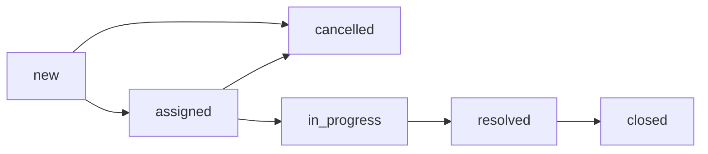
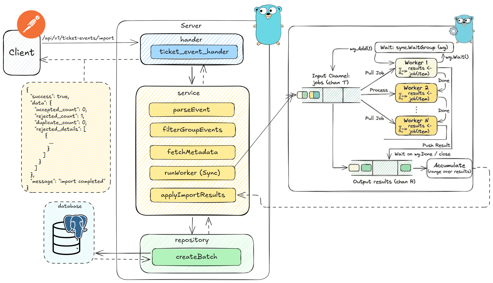
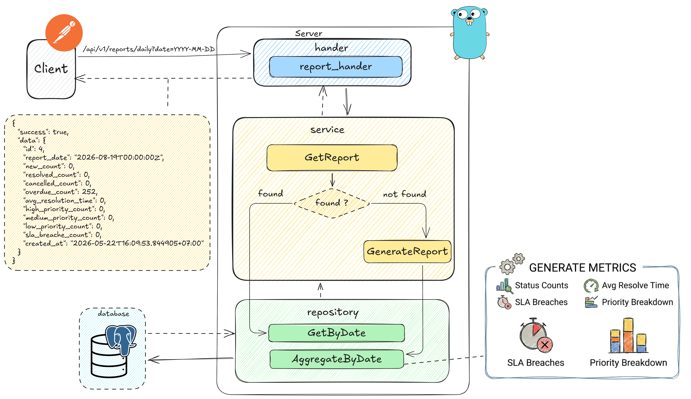

<div align="center">
  <h1>Support Ticket SLA Processing System</h1>
  <p>A robust backend project focusing on High-Performance Concurrency, RESTful APIs, Clean Architecture, and ETL Pipelines.</p>

  
  
  
  
</div>

## 📖 Description

This project is a comprehensive backend system designed to manage support tickets and calculate Service Level Agreements (SLA). Built primarily for training purposes, it emphasizes the practical application of Golang's concurrency model (worker pools), robust REST API design, complex database interactions, test-driven development (TDD), and data pipelines (ETL).


## Business Context

The system models internal support tickets for IT, HR, or facilities requests. Ticket events are imported in high-volume batches and must be validated. The system generates Service Level Agreement (SLA) reports to track agent resolution performance.

## Status Flow

Allowed status transitions are defined in `internal/domain/ticket.go`:



### 📊 Main System Workflows

#### 1. Batch Import Flow


#### 2. SLA Report Flow


## 🚀 Execution Plan

- **Week 5: Core Logic & Concurrency (No Database Yet!)**
  **Focus:** Think in Go. Set up your project structure, define your domain models (structs), and build the validation logic. Build your concurrent worker pool in-memory first.
  **Goal:** By the end of the week, you should be able to run `go test ./...` or `go run ./cmd/import-sample` to process a mock batch of data and output a result like: `{"accepted_count": 80, "rejected_count": 15, "duplicate_count": 5}`.

- **Week 6: REST API & Database Integration**
  **Focus:** Connect the plumbing. Write your PostgreSQL schema and migrations. Build the Repository layer to save/fetch data. Wrap your logic in REST endpoints.
  **Goal:** By the end of the week, running `docker compose up` should start both your app and the database. You should be able to hit your POST endpoints using Postman or cURL.

- **Week 7: Testing & Quality Assurance**
  **Focus:** Break your code before the instructors do. Write comprehensive table-driven unit tests for all business rules. Standardize your error handling (e.g., clear 400 vs 500 error formats). Set up GitHub actions.
  **Goal:** Your CI pipeline should run green automatically whenever someone pushes code to the repository.

- **Week 8: Data Pipelines (ETL) & Final Demo**
  **Focus:** Data aggregation and presentation. Build the daily reporting job that reads your raw tables and writes to a reporting table. Polish your README.
  **Goal:** You can run `go run ./cmd/report --date=2026-05-04` and fetch the results via API. You are fully prepared to present your architecture and demonstrate the app live.

## 🛠 Prerequisites

- **Go**: 1.26
- **Docker & Docker Compose**: For containerized deployment
- **Make**: (Optional but recommended) For executing predefined build commands

## ⚙️ Environment Variables

Create a `.env` file in the root directory based on the following configurations:

```env
# PostgreSQL Container Configuration
POSTGRES_USER=postgres
POSTGRES_PASSWORD=<your_postgres_password>
POSTGRES_DB=ticket_sla
POSTGRES_HOST_PORT=5433
POSTGRES_CONTAINER_PORT=5432

# Database Configuration (Local Development)
# Note: App runs locally and connects to DB via exposed host port (5433)
DB_HOST=localhost
DB_PORT=5433
DB_USER=postgres
DB_PASSWORD=<your_postgres_password>
DB_NAME=ticket_sla
DB_SSLMODE=disable

# Server Configuration
APP_PORT=8080

# Keycloak Configuration
KEYCLOAK_HOST_PORT=8180
KEYCLOAK_ADMIN=admin
KEYCLOAK_ADMIN_PASSWORD=<your_keycloak_password>
KEYCLOAK_REALM=phase2
KEYCLOAK_CLIENT_ID=support-ticket-api
KEYCLOAK_CLIENT_SECRET=<your_client_secret>
KEYCLOAK_BASE_URL=http://localhost:8180

# Worker Pool Configuration
WORKER_POOL_SIZE=20
MAX_BATCH_SIZE=100000
```

## 💻 Installation & Run

We use `Makefile` to simplify common operations.

### Using Docker (Recommended)
Our `docker-compose.yml` orchestrates three main services:
- **`postgres`**: The primary database (Port 5433).
- **`keycloak`** & **`keycloak-db`**: Authentication and Identity Provider (Port 8180).
- **`app`**: The main Go backend application (Port 8080).

```bash
# Start all services (App, PostgreSQL, Keycloak)
make docker-up

# Rebuild images and start services
make docker-up-build

# View application logs
make docker-logs

# Stop all services
make docker-down
```

### Running Locally

```bash
# Start the API server
make run

# Run all unit and integration tests
make test

# Generate Swagger documentation
make swagger
```

## 🔌 API Documentation

All API routes are prefixed with `/api/v1`. Authentication is handled via Bearer Tokens (JWT).

| Method | Endpoint | Description | Required Role |
|:---|:---|:---|:---|
| `POST` | `/auth/login` | Authenticate and retrieve JWT token | *None* |
| `POST` | `/tickets` | Create a new support ticket | `Requestor` |
| `GET` | `/tickets` | List and paginate tickets | `Requestor`, `Agent`, `Manager` |
| `GET` | `/tickets/:id` | Fetch specific ticket details | `Requestor`, `Agent`, `Manager` |
| `PATCH`| `/tickets/:id/status` | Update a ticket's status | `Agent` |
| `POST` | `/ticket-events/import` | Batch import historical ticket events | `Agent` |
| `GET` | `/reports/daily` | Retrieve daily SLA performance report | `Manager` |

*Swagger UI is available at `/swagger/index.html` when the server is running.*

## ⚡ Concurrency Model

The system efficiently handles massive batch imports of ticket events using an **In-Memory Worker Pool** pattern (`internal/worker/job.go`).

Instead of processing items sequentially, it spins up multiple worker goroutines (configurable via `WORKER_POOL_SIZE`). It uses Go channels (`jobs` and `results`) and `sync.WaitGroup` to distribute the workload concurrently across available CPU cores. This guarantees high-throughput performance while preventing memory exhaustion.


## 📂 Project Structure

```text
support-ticket-sla/
├── cmd/
│   ├── api/
│   │   ├── event-sample.json
│   │   └── main.go
│   │   ├── event-sample.json
│   │   └── main.go
│   ├── import-sample/
│   │   └── main.go
│   │   └── main.go
│   └── report/
│       └── main.go
│       └── main.go
│
├── docs/
│   ├── docs.go
│   ├── swagger.json
│   └── swagger.yaml
│
│   ├── docs.go
│   ├── swagger.json
│   └── swagger.yaml
│
├── internal/
│   ├── app/
│   │   └── app.go
│   ├── app/
│   │   └── app.go
│   ├── auth/
│   │   ├── claims.go
│   │   ├── context.go
│   │   └── keycloak.go
│   │   ├── claims.go
│   │   ├── context.go
│   │   └── keycloak.go
│   ├── config/
│   │   ├── config.go
│   │   └── database.go
│   ├── dto/
│   │   ├── common/
│   │   ├── request/
│   │   └── response/
│   ├── errmsgs/
│   │   └── errors.go
│   ├── handler/
│   │   ├── auth_handler.go
│   │   ├── helper.go
│   │   ├── report_handler.go
│   │   ├── ticket_event_handler.go
│   │   └── ticket_handler.go
│   ├── middleware/
│   │   └── auth_middleware.go
│   ├── migration/
│   │   └── migrate.go
│   ├── model/
│   │   ├── ticket.go
│   │   ├── ticket_event.go
│   │   └── ticket_report.go
│   │   ├── config.go
│   │   └── database.go
│   ├── dto/
│   │   ├── common/
│   │   ├── request/
│   │   └── response/
│   ├── errmsgs/
│   │   └── errors.go
│   ├── handler/
│   │   ├── auth_handler.go
│   │   ├── helper.go
│   │   ├── report_handler.go
│   │   ├── ticket_event_handler.go
│   │   └── ticket_handler.go
│   ├── middleware/
│   │   └── auth_middleware.go
│   ├── migration/
│   │   └── migrate.go
│   ├── model/
│   │   ├── ticket.go
│   │   ├── ticket_event.go
│   │   └── ticket_report.go
│   ├── repository/
│   │   ├── event_repository.go
│   │   ├── report_repository.go
│   │   └── ticket_repository.go
│   ├── router/
│   │   └── router.go
│   ├── service/
│   │   ├── auth_service.go
│   │   ├── keycloak_service.go
│   │   ├── report_service.go
│   │   ├── ticket_event_service.go
│   │   └── ticket_service.go
│   └── worker/
│       └── job.go
│
├── tests/
│   ├── integration/
│   ├── mock/
│   │   ├── event_repository.go
│   │   ├── report_repository.go
│   │   └── ticket_repository.go
│   ├── router/
│   │   └── router.go
│   ├── service/
│   │   ├── auth_service.go
│   │   ├── keycloak_service.go
│   │   ├── report_service.go
│   │   ├── ticket_event_service.go
│   │   └── ticket_service.go
│   └── worker/
│       └── job.go
│
├── tests/
│   ├── integration/
│   ├── mock/
│   ├── service/
│   └── worker/
│
├── .github/
│   └── workflows/
│       └── ci.yml
│       └── ci.yml
│
├── docker-compose.yml
├── Dockerfile
├── Makefile
├── .env.example
├── docker-compose.yml
├── Dockerfile
├── Makefile
├── .env.example
├── .gitignore
├── go.mod
├── go.sum
└── README.md
```
