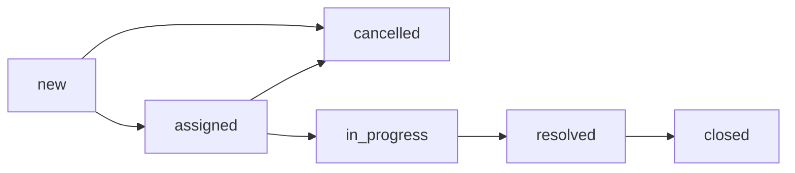

<div align="center">
  <h1>Support Ticket SLA Processing System</h1>
  <p>A robust backend project focusing on High-Performance Concurrency, RESTful APIs, Clean Architecture, ETL Pipelines, and Centralized Logging.</p>

  
  
  
  
  
  
  
</div>

## 📖 Description

This project is a comprehensive backend system designed to manage support tickets and calculate Service Level Agreements (SLA). Built primarily for training purposes, it emphasizes the practical application of Golang's concurrency model (worker pools), robust REST API design, complex database interactions, test-driven development (TDD), data pipelines (ETL), and observability.

## Business Context

The system models internal support tickets for IT, HR, or facilities requests. Ticket events are imported in high-volume batches and must be validated. The system generates Service Level Agreement (SLA) reports to track agent resolution performance.

## Status Flow

Allowed status transitions are defined in `internal/domain/ticket.go`:



### 📊 Main System Workflows

#### 1. Batch Import Flow


#### 2. SLA Report Flow


---

## Key Features

### 1. High-Performance Batch Import (ETL)
* Processes large-volume ticket event imports concurrently using an **In-Memory Worker Pool** pattern.
* Leverages Go channels (`jobs` and `results`) and `sync.WaitGroup` to scale processing safely across multiple worker goroutines.

### 2. Audit Logging & MinIO Integration
* Any duplicate or invalid ticket events encountered during batch import are rejected and detailed in an audit report.
* These error reports are dynamically formatted as CSV files and uploaded to a local **MinIO** object storage bucket (`audit-logs`).
* **API Download**: Managers or agents can download the audit reports using the endpoint `GET /api/v1/ticket-events/import/logs/:filename`.

### 3. Daily SLA Report Cron Job
* A background cron scheduler (powered by `robfig/cron`) runs automatically at **5:00 PM** daily to aggregate ticket metrics and compute agent resolution rates.

### 4. Automated HTML Email Notifications
* Upon cron job completion, the daily SLA report is rendered into a rich HTML template and dispatched directly to the IT Manager via **SMTP**.

### 5. Centralized Logging System (PLG Stack)
* Integrated **Grafana Loki** and **Promtail** for centralized log collection and visualization.
* **Shared Volume Architecture**: Container logs are captured in a shared Docker volume (`app_logs`), making Promtail read operations completely isolated and independent of the host filesystem permissions.

### 6. AI-Powered Ticket Triage & Multi-AI Fallback
* **Local AI Integration**: Leverages **Ollama** and a fine-tuned **Qwen2.5** model for automated ticket triage (category, urgency, SLA risk) with strictly enforced JSON outputs, ensuring data privacy and cost-efficiency.
* **Multi-AI Fallback Chain**: Implements a robust *Chain of Responsibility* architecture. If the primary Local AI fails or returns low confidence (< 0.5), the system gracefully falls back to Cloud AI providers (e.g., Groq, Gemini) or applies a heuristic Safe Fallback based on real-time SLA deadlines.
* **AI Batch Triage (High-Performance)**: The system supports evaluating massive lists of tickets concurrently for AI Triage utilizing a **Partial Success** strategy. Valid tickets are processed efficiently via a worker pool, while validation failures (e.g., overdue, closed tickets) are recorded individually without failing the entire batch.
* **AI Quality Evaluation**: Includes a specialized endpoint to assess the accuracy of AI predictions against a seeded ground-truth dataset, providing automated scoring and transparency into model performance over time.

---

## Prerequisites

- **Go**: 1.26
- **Docker & Docker Compose**: For containerized deployment
- **Make**: For executing build/run commands easily

---

## Environment Variables

Create a `.env` file in the root directory based on the following configurations:

```env
# PostgreSQL Container Configuration
POSTGRES_USER=postgres
POSTGRES_PASSWORD=postgres
POSTGRES_DB=ticket_sla
POSTGRES_HOST_PORT=5433
POSTGRES_CONTAINER_PORT=5432

# Database Configuration (Local Development via go run)
DB_HOST=localhost
DB_PORT=5433
DB_USER=postgres
DB_PASSWORD=postgres
DB_NAME=ticket_sla
DB_SSLMODE=disable

# Server Configuration
APP_PORT=8080
SERVER_PORT=8080

# Keycloak Configuration
KEYCLOAK_HOST_PORT=8180
KEYCLOAK_ADMIN=admin
KEYCLOAK_ADMIN_PASSWORD=<your_keycloak_password>
KEYCLOAK_REALM=phase2
KEYCLOAK_CLIENT_ID=support-ticket-api
KEYCLOAK_CLIENT_SECRET=<your_client_secret>
KEYCLOAK_BASE_URL=http://localhost:8180

# Worker Pool Configuration
WORKER_POOL_SIZE=5
MAX_BATCH_SIZE=100000

# MinIO Configuration
MINIO_ENDPOINT=localhost:9000
MINIO_ACCESS_KEY=minioadmin
MINIO_SECRET_KEY=minioadmin
MINIO_USE_SSL=false
MINIO_BUCKET_NAME=audit-logs

# SMTP Configuration
SMTP_HOST=smtp.gmail.com
SMTP_PORT=587
SMTP_USER=your_email@gmail.com
SMTP_PASS=your_app_password
MANAGER_EMAIL=manager_email@gmail.com

# Grafana & Loki Configuration
GRAFANA_PORT=3000
LOKI_PORT=3100

# AI & Triage Configuration
AI_ENABLED=true
AI_PROVIDER=ollama
AI_MODEL=qwen2.5:0.5b
AI_FALLBACK_CHAIN=groq:llama3-8b-8192,gemini:gemini-1.5-flash
AI_MAX_BATCH_SIZE=30
AI_WORKER_POOL_SIZE=3
```
* Note: The default credentials provided below are for local development purposes only. Please ensure you generate strong, unique passwords for production environments.
---

## 💻 Installation & Run

### Using Docker (Recommended)
Our Docker Compose orchestrates the full environment:
- **`app`**: The Go backend API.
- **`postgres`**: The primary database.
- **`keycloak`** & **`keycloak-db`**: Authentication services.
- **`minio`**: Object storage for audit reports.
- **`loki`** & **`promtail`**: Centralized log collection.
- **`grafana`**: Visualization dashboard.

```bash
# Start all services
make docker-up

# Rebuild images and start all services
make docker-up-build

# View application logs
make docker-logs

# Stop all services
make docker-down
```

### Running Locally (For Development)

```bash
# Start the API server locally
make run

# Run all unit and integration tests
make test

# Generate Swagger documentation
make swagger
```

---

## 🔌 API Documentation

All API routes are prefixed with `/api/v1`. Authentication is handled via Bearer Tokens (JWT).

| Method | Endpoint | Description | Required Role |
|:---|:---|:---|:---|
| `POST` | `/auth/login` | Authenticate and retrieve JWT token | *None* |
| `POST` | `/tickets` | Create a new support ticket | `Requestor` |
| `GET` | `/tickets` | List and paginate tickets | `Requestor`, `Agent`, `Manager` |
| `GET` | `/tickets/:id` | Fetch specific ticket details | `Requestor`, `Agent`, `Manager` |
| `PATCH`| `/tickets/:id/status` | Update a ticket's status | `Agent` |
| `POST` | `/ticket-events/import` | Batch import historical ticket events | `Agent` |
| `GET` | `/ticket-events/import/logs/:filename` | Download batch import audit logs from MinIO | `Agent`, `Manager` |
| `GET` | `/reports/daily` | Retrieve daily SLA performance report | `Manager` |
| `POST` | `/ai/tickets/:id/triage` | Trigger AI triage for a single ticket | `Agent` |
| `GET` | `/ai/tickets/:id/triage/latest` | Fetch the latest AI triage result | `Agent`, `Manager` |
| `POST` | `/ai/tickets/triage:batch` | Batch process multiple tickets using AI triage | `Agent` |
| `POST` | `/ai/evaluations/ticket-triage` | Run automated AI evaluation against ground-truth dataset | `Manager` |

*Swagger UI is available at `/swagger/index.html` when the server is running.*

---

## 📊 Centralized Logging & Monitoring Guide

1. Open Grafana at `http://localhost:3000` (Default Credentials: `admin` / `admin`).
2. Go to the **Explore** tab on the left sidebar.
3. Select **Loki** as the data source from the dropdown.
4. Enter the query `{container="ticket-sla-api"}` and click **Run query** to view your application logs.

---

## 📂 Project Structure

```text
support-ticket-sla/
├── cmd/
│   ├── api/                 # Main API entrypoint
│   ├── import-sample/       # Script to generate sample events
│   └── report/              # Manual SLA report trigger
├── docs/                    # Architecture diagrams & Swagger API specs
├── internal/
│   ├── ai/                  # AI Core Logic & Adapters
│   │   ├── factory/         # Factory for fallback AI initialization
│   │   ├── prompts/         # AI Prompt templates (.tmpl files)
│   │   └── provider/        # Implementations of AI adapters
│   ├── app/                 # Application bootstrap
│   ├── auth/                # Authentication & Keycloak integration
│   ├── config/              # Environment configurations
│   ├── cron/                # Scheduled background jobs
│   ├── dto/                 # Data Transfer Objects (Requests/Responses)
│   ├── handler/             # HTTP Controllers (REST endpoints)
│   ├── middleware/          # HTTP Middleware (Auth, Logging)
│   ├── model/               # Database Entities & Domain Models
│   ├── repository/          # Data Access Layer
│   ├── router/              # HTTP Route Definitions
│   ├── seeding/             # Database Seeders (e.g. AI Eval Cases)
│   ├── service/             # Business Logic Layer (Triage, Batch, SLA)
│   ├── templates/           # HTML templates (e.g. Email reports)
│   └── worker/              # Worker Pool logic for concurrent tasks
├── logging/                 # Grafana, Loki, Promtail configuration
├── scripts/
│   └── import_model.ps1     # Automation script to load Local AI models
├── tests/                   # Unit and Integration Tests
│   ├── ai/
│   ├── handler/
│   ├── service/
│   └── mock/
├── ai-model/                # Directory for local GGUF models
├── docker-compose.yml       # Docker environment orchestration
├── Dockerfile               # API Container definition
├── Makefile                 # Make commands for build/run/test
├── Modelfile                # Ollama model definition template
├── dataset.jsonl            # Fine-tuning dataset
└── README.md
```
